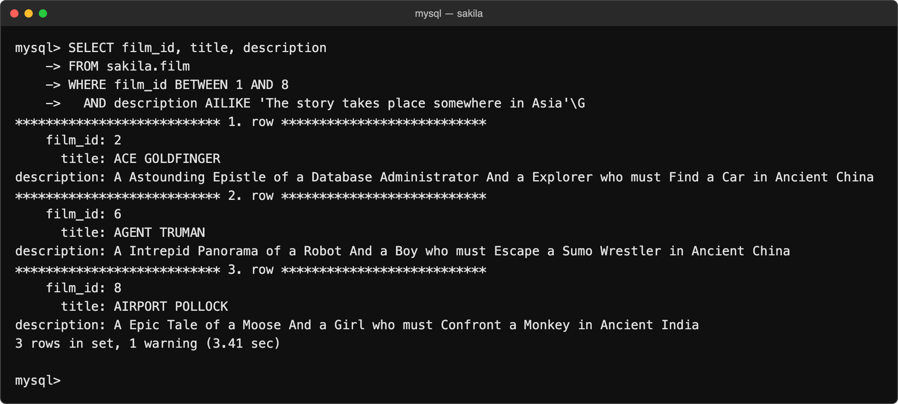
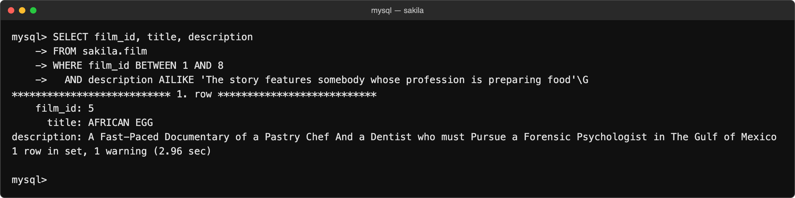
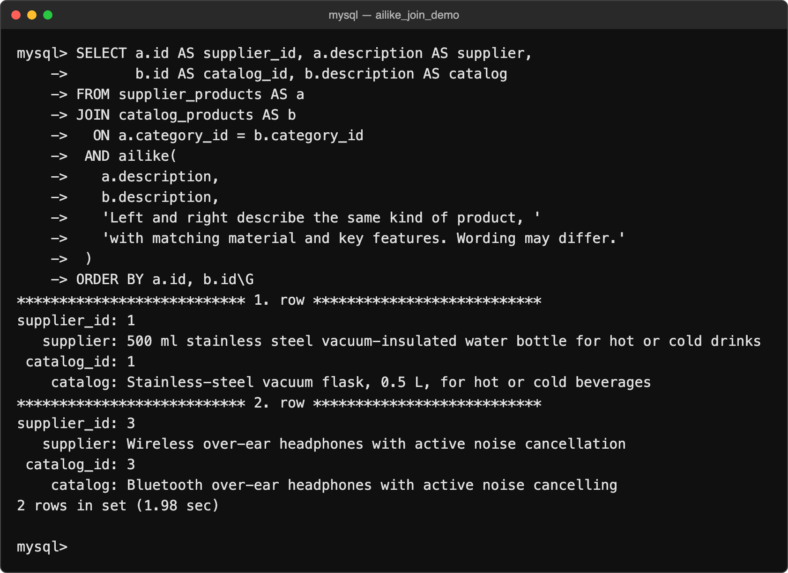
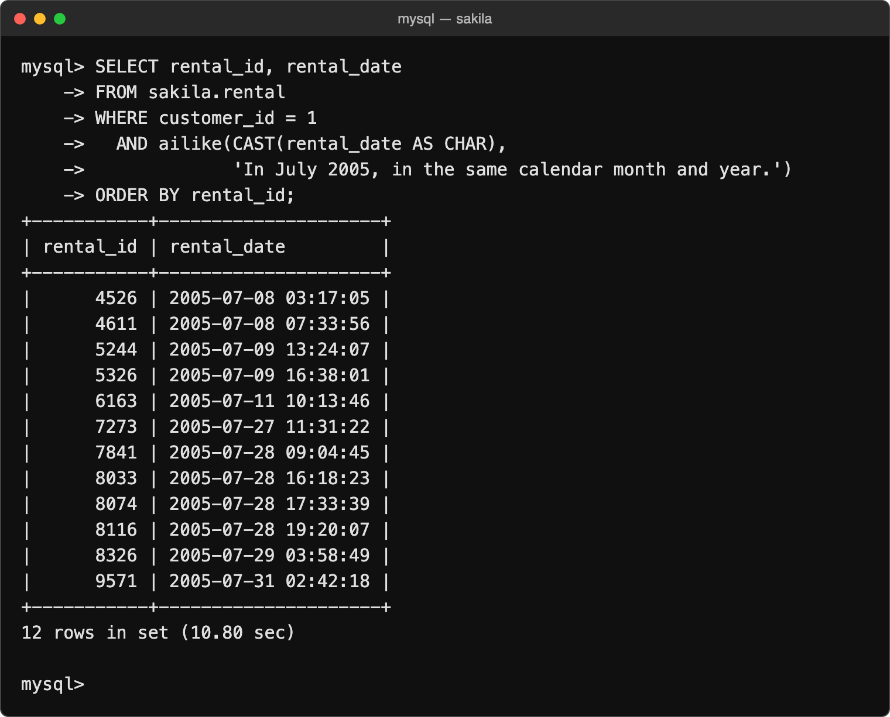

# AILIKE for MySQL

Filter rows and compare text columns with natural-language conditions, powered by
[TypeSafe Jev](https://docs.typesafe.ai).

```sql
SELECT film_id, title, description
FROM sakila.film
WHERE film_id BETWEEN 1 AND 8
  AND description AILIKE 'The story takes place somewhere in Asia';
```

Find stories set in Asia when their descriptions mention China or India.



[Terminal-style renderings of MySQL output](docs/screenshots/README.md).
Use `\G` instead of `;` in the MySQL client to display rows vertically.

AILIKE is a native MySQL plugin that runs inside your existing server.

**[Plugin bundles, installation, and verified compatibility →](docs/install.md)**

Try the query with the [Sakila sample data](docs/sample-data.md).

<details>
<summary>Another semantic match: finding someone who prepares food</summary>

```sql
SELECT film_id, title, description
FROM sakila.film
WHERE film_id BETWEEN 1 AND 8
  AND description AILIKE 'The story features somebody whose profession is preparing food';
```

The condition matches a description about a pastry chef.



</details>

<details>
<summary>Why does MySQL show “1 warning”?</summary>

For infix queries, MySQL records a `Note` that the rewrite plugin translated
`column AILIKE 'prompt'` into `ailike(column, 'prompt')`. Inspect it with
`SHOW WARNINGS;`. This note does not indicate a failed query.


</details>

| Syntax | Question |
| --- | --- |
| `column AILIKE 'condition'` | Does this value satisfy the condition? |
| `ailike(value, prompt)` | Does this value satisfy the condition? |
| `ailike(left, right, prompt)` | Do these two values satisfy the relationship? |

## Compare joined columns

After installing AILIKE and configuring its API key, run `mysql -u root -p` from
the repository root. Load the [demo dataset](sql/join-demo.sql) into a fresh database:

```sql
CREATE DATABASE ailike_join_demo;
USE ailike_join_demo;
SOURCE sql/join-demo.sql;
```

The dataset contains three supplier products and three catalog products.
Pass both columns as values and describe their relationship in the prompt:

```sql
SELECT a.id AS supplier_id, a.description AS supplier,
       b.id AS catalog_id, b.description AS catalog
FROM supplier_products AS a
JOIN catalog_products AS b
  ON a.category_id = b.category_id
 AND ailike(
   a.description,
   b.description,
   'Left and right describe the same kind of product, '
   'with matching material and key features. Wording may differ.'
 )
ORDER BY a.id, b.id;
```

Expected matches are `(1, 1)` for the steel bottle and vacuum flask, and `(3, 3)`
for the headphones. The glass carafe and plastic bottle have no matching pair.



The two values reach Jev as separate `left` and `right` fields. Refer to those
names when direction matters. Ordinary join conditions narrow the candidate
pairs; each uncached comparison makes an API request.

Use the function form for expressions, column-supplied prompts, and bound
parameters: `ailike(a.description, b.description, ?)`. All arguments are strings;
cast other types to text. The result is `1` for a match and `0` otherwise; a
`NULL` argument produces `NULL`. Infix syntax takes one column and a literal
prompt.

Three-argument comparisons require v0.2.0 or newer; see the
[upgrade instructions](docs/install.md#upgrade).
Use SQL normalization and equality for exact identifiers.

## Match dates described in words

Use the function form for literal values:

```sql
SELECT ailike('2027-07-01', 'In July 2027, in the same calendar month and year.');
```

Cast date columns to text. Use ordinary SQL to narrow candidates before applying
the natural-language condition, as in this Sakila example:

```sql
SELECT rental_id, rental_date
FROM sakila.rental
WHERE customer_id = 1
  AND ailike(CAST(rental_date AS CHAR),
             'In July 2005, in the same calendar month and year.')
ORDER BY rental_id;
```



Specify the year when it matters: `same month as July 27` is ambiguous. AILIKE
returns a model judgment; use SQL date functions for exact date comparisons.

For AI coding agents: [AILIKE usage skill](skills/mysql-ailike/SKILL.md).

[GPL-2.0-only](LICENSE)
