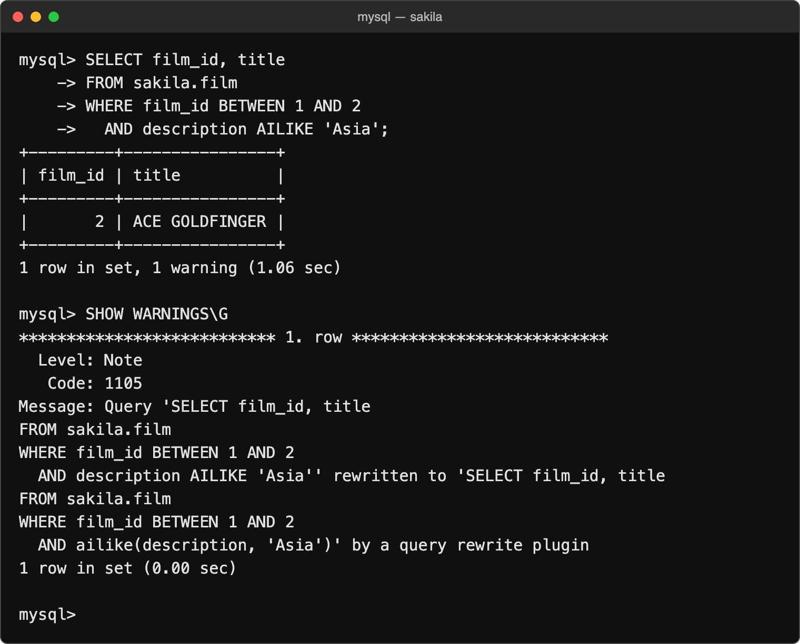

# Install into an existing MySQL server

AILIKE installs as two native shared libraries.

The v0.2.0 implementation was verified on 2026-09-20 (Oracle Linux 9 containers,
glibc 2.34):

| Platform | MySQL | Installation and SQL tests | Live Jev judgments |
| --- | --- | --- | --- |
| Linux ARM64 | 8.4.8 | 63 checks passed locally | 24 Sakila + 6 synthetic pair judgments passed |
| Linux ARM64 | 8.0.46 | 63 checks passed locally | Not run |
| Linux AMD64 | 8.4.8 | 63 checks passed in CI | Not run |
| Linux AMD64 | 8.0.46 | 63 checks passed in CI | Not run |

[Verified CI run](https://github.com/maayanlevy/mysql-ailike/actions/runs/35471276723).
SQL checks cover both function forms, joined columns, prepared statements,
installation, uninstallation, reinstallation, and persistence across a server
restart. Live judgments describe these sample inputs, not an accuracy guarantee.

Other MySQL versions, MariaDB, Windows, and macOS are not
verified. The shared libraries require glibc 2.34 or newer, libcurl 7.76 or newer
(`libcurl.so.4`), and a compatible `libstdc++.so.6`. Match your server's CPU
architecture.

You need access to the server filesystem and a MySQL administrative account. Managed services must permit custom native plugins. MySQL needs outbound HTTPS access to TypeSafe and working CA certificates.

## 1. Download the plugin bundle

On the target Linux server, start in an empty working directory. This downloads
the `v0.2.0` bundle for the server's architecture, verifies its checksum, and
extracts it into `dist/`:

```sh
(
  set -eu
  case "$(uname -s):$(uname -m)" in
    Linux:x86_64) arch=amd64 ;;
    Linux:aarch64|Linux:arm64) arch=arm64 ;;
    *) echo 'Prebuilt bundles support Linux AMD64 and ARM64 only.' >&2; exit 1 ;;
  esac
  release_url=https://github.com/maayanlevy/mysql-ailike/releases/download/v0.2.0
  archive="mysql-ailike-linux-${arch}.tar.gz"
  curl -fLO "$release_url/$archive"
  curl -fLO "$release_url/SHA256SUMS"
  awk -v archive="$archive" '
    $2 == archive { print; found++ }
    END { exit (found != 1) }
  ' SHA256SUMS > SHA256SUMS.selected
  sha256sum --check SHA256SUMS.selected
  mkdir dist
  tar -xzf "$archive" -C dist
)
```

The bundle contains both shared libraries, installation and uninstallation SQL,
this guide as `INSTALL.md`, and license notices. Run the remaining commands from
the directory containing `dist/`.

Alternatively, build from source with Git and Docker installed:

```sh
git clone --branch v0.2.0 --depth 1 https://github.com/maayanlevy/mysql-ailike.git
cd mysql-ailike
./scripts/build-plugin.sh
```

This also exports the bundle into `dist/`. Docker is used for compilation; the
libraries run inside your existing MySQL server.

## 2. Copy the libraries

Find the target server's plugin directory:

```sh
mysql -u root -p -e "SHOW VARIABLES LIKE 'plugin_dir';"
```

On the server, set `PLUGIN_DIR` to the exact directory reported above, check the bundle's dependencies, then copy the libraries:

```sh
PLUGIN_DIR=/path/reported/by/mysql
ldd dist/ailike_udf.so dist/ailike_rewrite.so
sudo install -o root -g root -m 755 \
  dist/ailike_udf.so dist/ailike_rewrite.so "$PLUGIN_DIR/"
```

Resolve any missing libraries or version errors reported by `ldd` before continuing. Keep the plugin directory writable only by trusted administrators.

## 3. Configure the server's API key

For a systemd-managed server, create a private environment file:

```sh
sudo install -d -o root -g root -m 755 /etc/mysql
sudo install -o root -g root -m 600 /dev/null /etc/mysql/ailike.env
sudoedit /etc/mysql/ailike.env
```

Add your key in the editor:

```ini
TYPESAFE_API_KEY=your-typesafe-api-key
```

Run `sudo systemctl edit mysqld` and add this override. Use your actual service name if it is `mysql` instead of `mysqld`.

```ini
[Service]
EnvironmentFile=/etc/mysql/ailike.env
```

Systemd reads the root-owned file and passes the variable to MySQL. Restart once to apply it:

```sh
sudo systemctl daemon-reload
sudo systemctl restart mysqld
```

For another service manager, supply `TYPESAFE_API_KEY` in the MySQL server process environment. Alternatively, set `TYPESAFE_API_KEY_FILE` to a file readable by the MySQL operating-system user. Setting either variable only in your SQL client's shell does not configure the server.

## 4. Register and use AILIKE

```sh
mysql -u root -p < dist/install.sql
```

Registration persists across server restarts. Check it with a sample value; this makes one TypeSafe request without reading an application table:

```sql
SELECT description AILIKE 'Includes a robot' AS matches
FROM (SELECT 'A robot helps a child.' AS description) AS example;
```

Then use `column AILIKE 'condition'`, `ailike(value, prompt)`, or
`ailike(left, right, prompt)` in your queries. For function-only installation,
register just the first statement in `dist/install.sql`; both function forms are
available without the rewrite plugin.

To uninstall, stop queries using AILIKE and run the following before removing either library:

```sh
mysql -u root -p < dist/uninstall.sql
```

See MySQL's [plugin installation](https://dev.mysql.com/doc/refman/8.4/en/plugin-loading.html) and [loadable function registration](https://dev.mysql.com/doc/refman/8.4/en/create-function-loadable.html) documentation for administrative requirements.

## Upgrade

Download and verify the new bundle before upgrading. Stop queries using AILIKE,
then unregister the old installation while its libraries are still in place:

```sh
mysql -u root -p < dist/uninstall.sql
```

Replace both libraries using [step 2](#2-copy-the-libraries), then register them
again using [step 4](#4-register-and-use-ailike) before resuming queries. Do not
overwrite a library while it is loaded. For a function-only installation, run
only `DROP FUNCTION IF EXISTS ailike;` before replacing its library, then register
the function again. Existing tables and server API-key configuration are retained.

## SQL behavior

`AILIKE` asks Jev a yes/no question and matches when its probability is at least
0.5. `ailike(value, prompt)` evaluates one value; `ailike(left, right, prompt)`
evaluates a relationship between two values. Both values are sent as separate
`left` and `right` data fields; the prompt describes the relationship, including
its direction when relevant. All arguments must be strings; use
`CAST(... AS CHAR)` for other types. Any `NULL` argument returns `NULL` without
making an API request. The model is pinned to
`jev-1.13.0`; `TYPESAFE_MODEL` can select another version.

```sql
WHERE description AILIKE 'Includes a robot'
WHERE f.description NOT AILIKE 'Set in Europe'
WHERE ailike(CONCAT(title, ': ', description), 'Set in Europe')
WHERE ailike(a.description, b.description, 'Left and right describe the same product type')
```

Infix syntax supports bare, qualified, or backtick-quoted columns and single-quoted
prompts. Use doubled single quotes inside prompts. Use function syntax for
expressions, dynamic prompts, backslash escapes, or prepared statements with
parameters: `WHERE ailike(description, ?)` or
`WHERE ailike(a.description, b.description, ?)`. Comparing two values requires the
three-argument function; `a.column AILIKE b.column USING 'relationship'` is not
supported. MySQL's pre-parse rewrite hook resets
parameter parsing, so the plugin rejects infix queries containing placeholders.

Each uncached argument tuple makes one HTTPS request to TypeSafe. Column values
leave the database. Narrow candidates with ordinary SQL before inference;
`LIMIT` alone does not cap calls. There is no index or batching. Results can be
wrong; this feature is intended for reads, not unattended data modifications or
statement-based replication.

The implementation caches duplicate argument tuples within each expression,
including both values and the prompt for three-argument calls. Memory is bounded,
and API failures abort the statement. Defaults are a 10-second request timeout
and 1,000 uncached requests per expression. Input limits are 32 KiB per value and
8 KiB for prompts. There are no automatic retries.

## Troubleshooting

### MySQL shows “1 warning” after an infix query

For infix queries, MySQL records a `Note` that the rewrite plugin translated
`column AILIKE 'prompt'` into `ailike(column, 'prompt')`. Inspect it with
`SHOW WARNINGS;`. This note does not indicate a failed query.



## Releasing

Pushing a `v*` tag runs the release workflow: it builds and tests Linux AMD64 and
ARM64 bundles on both supported MySQL versions, then attaches archives and
checksums to a draft GitHub release. Review the draft and publish it. See
[Releases](https://github.com/maayanlevy/mysql-ailike/releases). The repository's
visibility controls release visibility.
